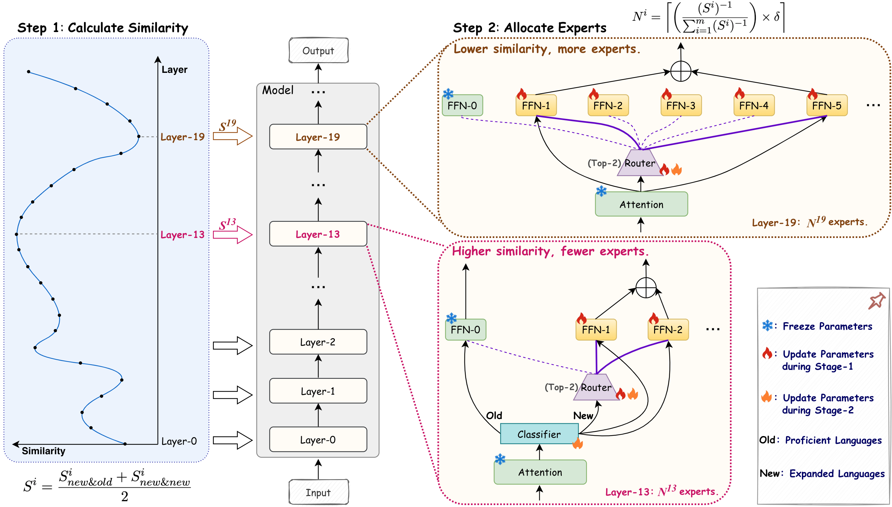

## LayerMoE ( *Less, but Better* : Efficient Multilingual Expansion for LLMs via Layer-wise Mixture-of-Experts)

Code for ACL-2025 (Main) paper "[*Less, but Better*: Efficient Multilingual Expansion for LLMs via Layer-wise Mixture-of-Experts"](https://arxiv.org/pdf/2505.22582).

<p align="center">
    <br>
    
    <br>
</p>


### Environment Requirements

Our code is implemented by modifying the [MoE-LPR](https://github.com/NJUNLP/MoE-LPR) project, specifically by making changes to the following components:

- The codes under the `tuners/moe/` directory in the peft library;
- The corresponding model files in the transformers library;
- The relevant codes are in the `data/` or `hparams/` directory of LLaMA Factory.

To minimize dependency conflicts, we have prepared two separate environments: one for Qwen1.5 and another for llama-3.2.

1. For Qwen1.5-1.8B
    ```
    conda env create -f layermoe-qwen/environment.yml

    cd layermoe-qwen
    tar -xzf transformers.tar.gz
    cd transformers
    pip install -e .

    tar -xzf peft.tar.gz
    cd peft
    pip install -e ./

    tar -xzf lm-evaluation-harness.tar.gz
    cd lm-evaluation-harness
    pip install -e .

    tar -xzf LLaMA-Factory.tar.gz
    ```


2. For Llama-3.2-3B

    ```
    conda env create -f layermoe-llama/environment.yml

    cd layermoe-llama
    tar -xzf transformers-4.45.0.tar.gz
    cd transformers-4.45.0
    pip install -e .

    tar -xzf peft.tar.gz
    cd peft
    pip install -e ./

    tar -xzf lm-evaluation-harness.tar.gz
    cd lm-evaluation-harness
    pip install -e .

    tar -xzf LLaMA-Factory.tar.gz
    ```


## Data

This section provides an overview of the data processing pipeline for our project. The training data details are described in Section 4.1 of our paper, and the implementation scripts can be found in the `data/` directory.


The `data/` directory contains the following scripts:

| Script | Description |
|--------|-------------|
| `download.sh` | Downloads the original datasets required for training |
| `CulturaX-pre.py` | Processes and counts 2B tokens for each targeted language (Greek, Hungarian, Turkish, Bengali, Hindi, and Nepali) (el/hu/tr/bn/hi/ne) |
| `CulturaX-sample.py` | Samples training examples for Spanish (es) from the CulturaX dataset |
| `SkyPile-sample.py` | Samples training examples for Chinese (zh) from the SkyPile dataset |
| `SlimPajama-sample.py` | Samples training examples for English (en) from the SlimPajama dataset |


### Step 1: Calculate Similarity


`similarity/cal-similarity-tokens_dense.py` is used to calculate the similarity for the original dense model. Then, an example of allocating new experts is listed in `similarity/llama3.2-3B-G1.xlsx`.

`similarity/cal-similarity-tokens_moe.py` is used to calculate the similarity for the MoE model.


### Step 2: Allocate Experts for post-pretraining


We list our training scripts and some scripts for baselines in the `*/scripts-train` directory.

An example for the "G0 ➡️ G1" setting:
```
bash layermoe-qwen/scripts-train/stage1-6B-layermoe-g1.sh
bash layermoe-qwen/scripts-train/stage2-6B-layermoe-g1.sh
```


An example for the "G0 ➡️ G1 ➡️ G2" setting:
```
bash layermoe-qwen/scripts-train/stage1-12B-layermoe-g2_base_g1.sh
bash layermoe-qwen/scripts-train/stage2-12B-layermoe-g2_base_g1.sh
```


### Evaluation

```
bash layermoe-qwen/scripts-eval/eval-g1.sh  # for evaluating G0 and G1
bash layermoe-qwen/scripts-eval/eval-g2.sh  # for evaluating G0 and G2
```


### Questions

If you have any questions, please create an issue or email me (23111135@bjtu.edu.cn).


### Acknowledgement
Our codes are based on [MoE-LPR](https://github.com/NJUNLP/MoE-LPR), and we thank their outstanding open-source contributions.


### Citation
If you find this work is useful, please consider citing our paper:

```
@misc{zhang2025lessbetterefficientmultilingual,
      title={Less, but Better: Efficient Multilingual Expansion for LLMs via Layer-wise Mixture-of-Experts}, 
      author={Xue Zhang and Yunlong Liang and Fandong Meng and Songming Zhang and Yufeng Chen and Jinan Xu and Jie Zhou},
      year={2025},
      eprint={2505.22582},
      archivePrefix={arXiv},
      primaryClass={cs.CL},
      url={https://arxiv.org/abs/2505.22582}, 
}
```
